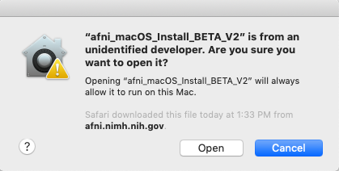
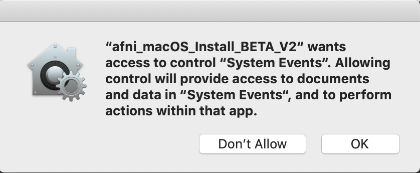
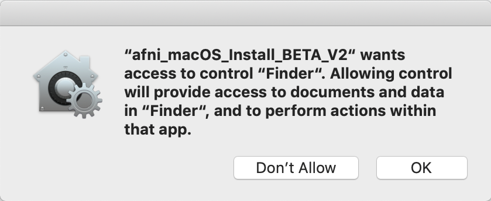
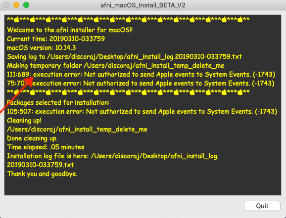

.. _install_steps_mac_app:

**Mac OS, 10.13-15** *(via App)*
=============================================================

.. contents:: The essential system setup
   :local:

Welcome to the Jungle [#f1]_
------------------------------

The following is a set of scripts packaged as an App. It is designed
to automate the AFNI installation steps. You should launch the script
by double clicking the icon like a regular program.  We have tested
the app on **OS 10.13 to 10.15** with various hardware.

This app will download and install the recommended versions of the
following:

1. Xcode Command Line Tools

#. Xquartz

#. Homebrew

#. R

#. AFNI

It can also run the afni_system_check, download class / bootcamp data, and
install shiny packages.

If a package is already installed, you may be asked if you want to
reinstall it.  But you can skip it if you like.  This script will also
setup your ``~/.cshrc``, ``~/.bashrc``, ``~/.bash_profile``, and
``~/.zshrc``.  It will add the appropriate entries to your paths
specified there.  After completion, you should restart your computer
just in case.

*If you are seeking the non-App version of install instructions (i.e.,
via command line), please see* :ref:`HERE <install_steps_mac>`.

Take the File and Run [#f2]_
------------------------------

* `Download macOS 10.13 to 10.15 download <https://afni.nimh.nih.gov/pub/dist/bin/misc/afni_macOS_Install_BETA_V3.zip>`_

.. note:: On macOS 10.15 there may be additional dialog boxes to approve.

Start Your Engines [#f3]_
--------------------------

* Download the file and extract the zip if it did not extract
  automatically in your Downloads folder.
* If you double click the "afni_macOS_install_BETA_V3" icon, you may
  get a popup notification about an "unidentified developer" similar
  to this:

    .. image:: media/mac_app_V2_first_dev_warning.png
        :width: 40%
        :align: center

* If so, you can continue by:
    * Right or control clicking the app icon.
    * Then click ``Open`` from the popup menu.
    * (see here for more info: https://support.apple.com/kb/PH25088)

    .. image:: media/mac_app_V2_right_click_open.png
        :width: 50%
        :align: center

    * Now you will be able to open it.

|

----

|

* You may also get warnings for "System Events" or "Finder" access.

+------------+------------+
| |warning1| | |warning2| +
+------------+------------+

    * These will grant access for the app to use apple script and automator for opening dialogs and using the Finder to choose folders.

* If you click "Don't Allow", this installer quit with an error similar to this:

* If you see this error, you can allow access by going to:
    * "System Preferences" -> "Security & Privacy" -> "Privacy" ->
      "Automation"
    * Click the lock to make changes and check the box(es) under the
      "afni_macOS_install_BETA_V2" entry.
    * Then run the installer again.

    .. image:: media/mac_app_V2_settings_privacy.png
        :width: 35%
        :align: center

.. note:: This is **NOT** an unattended install! The dialogs **WILL**
          time out after ~10 hours. 

Use your M-O-U-S-E!
-------------------

* The first dialog box is an introduction and brief explanation

    .. image:: media/mac_app_V2_intro.png
        :width: 40%
        :align: center

* You will see a text box that will show you the output from the
  terminal progress. (it may pop up behind your current window)

    .. image:: media/mac_app_V2_starting_text_box.png
        :width: 60%
        :align: center

.. note:: Everything you see in the text box will be saved to a log file on
            your desktop with a name similar to
            "afni_install_log.20190223-055115.txt"

* The next dialog presents you with choices of what to install.
    The recommended choices are automatically selected by default, but you
    can pick and choose what you want. You can multi select items using ⌘+click

    .. image:: media/mac_app_V2_selections.png
        :width: 40%
        :align: center

* Do you have the POWER?
    For some packages, you may need to enter your password in the dialog box.

    .. image:: media/mac_app_V2_password_dialog.png
        :width: 40%
        :align: center

.. note:: Notice that a temporary folder "afni_install_temp_delete_me" is
          created in your home directory. It will be deleted when
          you quit. If not, it is safe to delete.

Don't let the fear install [#f4]_
---------------------------------

Here are a few details of the choices that presented for installation.

Command Line Tools for Xcode
^^^^^^^^^^^^^^^^^^^^^^^^^^^^

The command line tools are mostly necessary for compiling some R
packages from source (gcc etc.).  But that mostly happens behind the
scenes so you won't have to deal directly with any of that.

The usual way of installing this is typing this in the terminal::

    xcode-select --install

* `See Apple developer page. <https://developer.apple.com/xcode/features/>`_

----

XQuartz
^^^^^^^

This is desktop manager needed to run X11 programs, such as ``afni``.

* During the install you may notice the xquartz installer drive
  briefly mount and unmount.

    .. image:: media/mac_app_V2_xquartz_dmg.png
        :width: 10%
        :align: center

* `See XQuartz main page. <https://www.xquartz.org/>`_

----

Homebrew 🍺
^^^^^^^^^^^

No. Not beer, but a package manager for macOS.  It is used to install
netpbm which has functionality for converting image formats (such as
to PNG) and is used in several programs like ``@snapshot_volreg``,
``@chauffeur_afni`` and others.

Also installs openmpi for multiprocessor support in R.

* `See Homebrew main page. <https://brew.sh/>`_

----

R ☠️
^^^^

This is what is usual the catch phrase of pirates on the high
seas. But here we are talking about the free software environment for
statistical computing and graphics. afni needs this for several of the
group analysis programs.

* The version installed with this app is version 3.6.3 (Holding the Windsock)
  released on 2020-02-29.

* The CRAN mirror is https://cloud.r-project.org so it should
  automatically choose a mirror close to your geographical location.

* `See R project main page. <https://www.r-project.org/>`_

----

AFNI
^^^^

AFNI is a set of C programs for processing, analyzing, and displaying
functional MRI (FMRI) data. (taken from the about page...)

A few thing are happening here.

* Basically running ``@update.afni.binaries``.  It will default to
  installing in ``~/abin``, but you can choose your own favorite
  folder.

    `@update.afni.binaries help page. <https://afni.nimh.nih.gov/pub/dist/doc/htmldoc/programs/@update.afni.binaries_sphx.html#ahelp-update-afni-binaries>`_

* Updates your ``~/.cshrc``, ``~/.bashrc``, ``~/.bash_profile``, ``~/.zshrc``,
  and other environments.

* Installs the R packages necessary for afni. First it checks to make
  sure you have R and Homebrew's openmpi
  installed. ``rPkgsInstall -pkgs ALL`` may fail without those...

    `rPkgsInstall help page. <https://afni.nimh.nih.gov/pub/dist/doc/htmldoc/programs/rPkgsInstall_sphx.html#ahelp-rpkgsinstall>`_

----

afni_system_check
^^^^^^^^^^^^^^^^^

Runs ``afni_system_check.py -check_all``.

If you selected ``afni_system_check`` (which you should do...),
you will be presented with a dialog to let you view it before you procede.

    .. image:: media/mac_app_V2_afni_system_check.png
        :width: 40%
        :align: center

The afni_system_check output will have been saved to your desktop.  It
is named something obvious like
"afni_system_check.20190208-145815.txt".  Clicking "View" will open
the file in your default text editor.  This file may be useful for
figuring out problems with the install, especially when posting to the
message board.

* `afni_system_check.py help page. <https://afni.nimh.nih.gov/pub/dist/doc/htmldoc/programs/afni_system_check.py_sphx.html#ahelp-afni-system-check-py>`_

.. note:: When you are finished with installation, you may want to
          open up the AFNI and SUMA GUIs, juuuust to make sure all is
          well::

            afni
            suma

----

Class / Bootcamp data download
^^^^^^^^^^^^^^^^^^^^^^^^^^^^^^

Download class data and prep it for bootcamps or your own practice.

* `Direct link. <https://afni.nimh.nih.gov/pub/dist/edu/data/CD.tgz>`_

You may want to do the following later:

1. Read+practice with the handy :ref:`Unix documentation/tutorial
   <U_misc_bg0>`.

   **Purpose:** give you a quick lesson/refresher on using basic Linux
   shell commands (e.g., `ls`, `cd`, `less`, etc.). It will *greatly*
   enhance your bootcamp experience-- we promise!

2. **Pro tip:** If you will be attending a Bootcamp, you might want to
   bring a mouse to use with your laptop. It will be easier to follow
   the demos using a mouse than a trackpad. (eh...)

----

Shiny packages
^^^^^^^^^^^^^^

Install optional packages for some of afni's shiny integrations.
You can learn more about shiny apps `here <https://shiny.rstudio.com/>`_.

* Runs::

    @afni_R_package_install -shiny -circos

* `@afni_R_package_install help page. <https://afni.nimh.nih.gov/pub/dist/doc/htmldoc/programs/@afni_R_package_install_sphx.html#ahelp-afni-r-package-install>`_

This is needed if you want to run any of these programs:

* `ClusterExplorer <https://afni.nimh.nih.gov/pub/dist/doc/htmldoc/tutorials/ClusterExplorer/Introduction.html>`_
* `FATCAT_matplot <https://afni.nimh.nih.gov/pub/dist/doc/htmldoc/tutorials/ClusterExplorer/Introduction.html>`_
* `3dMVM_validator <https://afni.nimh.nih.gov/pub/dist/doc/htmldoc/tutorials/3dMVM_validator/3dMVM_validator_overview.html>`_

All Done
---------

Upon completion of all installations, and barring any error, you
should see a completion dialog.

    .. image:: media/mac_app_V2_complete.png
        :width: 40%
        :align: center

Then you can review the text or quit the app.

    .. image:: media/mac_app_V2_quit.png
        :width: 40%
        :align: center

------------

Setup Python (opt)
---------------------------------

.. include:: substep_miniconda.rst

Keep up-to-date (remember!)
---------------------------

.. include:: substep_update.rst

---------------------------

Older Version BETA V1
---------------------

The following is a set of scripts packaged as an *app*. It is designed to
automate the AFNI installation steps. You should launch the script by double
clicking the icon like a regular program.

This app will download and install the recommended versions of the following:
 1. Xcode command line tools
 2. Xquartz
 3. R
 4. AFNI

If a package is already installed, you may be asked if you want to reinstall it.
But you can skip it if you like.
This script will also setup your ~/.cshrc, ~/.bashrc, and ~/.bash_profile.
It will add the appropriate entries to your paths specified there.
After completion, you should restart your computer just in case.

This is a **BETA** script, so your feedback is welcome. We have tested the app
on 10.10 to 10.13 with various hardware.

*If you are seeking the non-App version of install instructions,
please see* :ref:`HERE <install_steps_mac>`.

------------

* `Download OSX 10.7 to 10.11 Version (NO LONGER UPDATED!!!!) <https://afni.nimh.nih.gov/pub/dist/bin/misc/afni_macOS_install_10.7_BETA.zip>`_
* `Download macOS 10.12 or greater Version <https://afni.nimh.nih.gov/pub/dist/bin/misc/afni_macOS_install_10.12_BETA.zip>`_

------------

* Download the file and open it to extract the contents.
* Read the README!!
* Double click the "afni_macOS_install_10.7_BETA" or "afni_macOS_install_10.12_BETA" icon.
* You may get a popup notification about an "unidentified developer".

    .. image:: media/unknown_dev_warning.png
        :width: 40%
        :align: center

    If so, you can continue by:
        * Right click or control click the app icon.
        * Then click open from the shortcut menu.
        * (see here for more info: https://support.apple.com/kb/PH25088)

* This will launch your terminal.
    Most of the rest of the interactions are in the terminal.
    If needed, the Xcode command line tools will popup an installation window.
    Once complete, return to the terminal to continue.

* To accept the default options (shown in [ ]), just press Enter.
    For some sections, you may need to type in your password.
    If you are not an administrator on your computer, this installation may fail.
    Make sure you have permissions for the folder you choose for AFNI!
    The ``sudo`` prompt **will** time out after awhile, so this is
    **not** an unattended install.

* This script does not install fink. Nor does it download the class data.

    *The icon is a work in progress.
    If you have some design skills, please send me alternatives.*

.. rubric:: Footnotes

.. [#f1] Guns N' Roses
.. [#f2] Steve Miller Band
.. [#f3] Tears for Fears
.. [#f4] Birds by Coldplay
