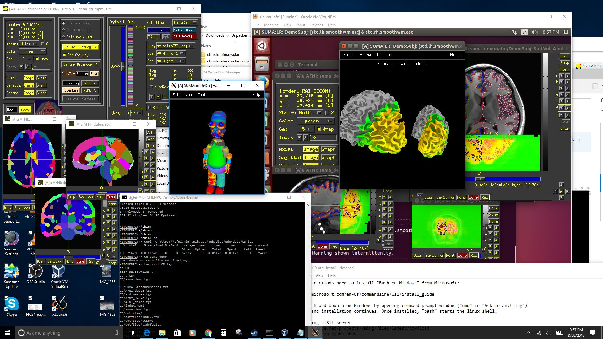

.. _install_steps_windows10:

**Windows 10: Windows Subsystem for Linux (WSL)**
===========================================================================

.. contents:: The essential system setup
   :local:

What to do?
-----------

These setup instructions are for setting up Ubuntu on the **"Fall
Creators Update" (FCU) version of Windows 10**, known as the **Windows
Subsystem for Linux (WSL).** This FCU was released in Windows version
1709 around October, 2017.

See `this "What's New" page
<https://blogs.msdn.microsoft.com/commandline/2017/10/11/whats-new-in-wsl-in-windows-10-fall-creators-update/>`_
for more information about the Windows updates since their earlier
beta version of having Ubuntu.  Mainly, the present installation is a
lot easier now.  Yippee.

#. **The user must have admin privileges** (can run ``sudo ...``).
   Some steps require an internet connection.

Install Linux
-----------------------------------

1. | Click here to install WSL, selecting "Ubuntu" as your desired flavor
     of Linux:
   | `https://docs.microsoft.com/en-us/windows/wsl/install-win10
     <https://docs.microsoft.com/en-us/windows/wsl/install-win10>`_

.. _install_windows_VcXsrv:

Install VcXsrv Windows X Server
---------------------------------------------

1. | Click here to start automatic download:
   | `https://sourceforge.net/projects/vcxsrv/files/latest/download
     <https://sourceforge.net/projects/vcxsrv/files/latest/download>`_
   | Use default installation settings.  

#. *Now and forever,* **first** doubleclick on the VcXsrv icon on your
   Desktop, and **then** start Ubuntu, for example by typing "ubuntu"
   in the Windows search bar.  (Sorry, not our design!)

#. **To enable copy+paste ability in Ubuntu terminal,** right-click on
   the toolbar at the top of the Ubuntu terminal, and select
   "Properties"; in the Options tab, make sure the box next to
   "QuickEdit Mode" is selected.

   You can then paste into a terminal by either right-clicking or
   hitting the "Enter" key.  (To "copy" text that is *in* the
   terminal, just highlight it, and then you should be able to
   right-click to paste; to "copy" text from *outside* the terminal,
   you probably need to highlight it and hit "Ctrl+c".)

#. Copy+paste::

     echo "export DISPLAY=:0.0" >> ~/.bashrc
     echo "setenv DISPLAY :0.0" >> ~/.cshrc
     echo "export NO_AT_BRIDGE=1" >> ~/.bashrc
     echo "setenv NO_AT_BRIDGE 1" >> ~/.cshrc

   **Purpose:** First, set DISPLAY properly, so you can open GUIs like
   ``afni``, ``suma``, etc.  Then, avoid having some
   very-non-necessary GTK warnings from programs.
    
#. Close (exit) Ubuntu terminal, so that changes are effected the next
   time you open it.

Install prerequisite: AFNI and  package dependencies
----------------------------------------------------

0. Start a new Ubuntu session.  To check your version, copy+paste::

     lsb_release -a

#. For ... 

   * | *... Ubuntu 16.04 users,* follow the setup instructions
       through "Make AFNI/SUMA profiles" here:
     | :ref:`Link to Ubuntu 16 setup instructions for AFNI <install_steps_linux_ubuntu16>`

   * | *... Ubuntu 18.04 users,* follow the setup instructions
       through "Make AFNI/SUMA profiles" here:
     | :ref:`Link to Ubuntu 18 setup instructions for AFNI <install_steps_linux_ubuntu18>`

   **Purpose:** Complete your life's ambition to have working AFNI on
   your Windows computer (though, realize it is Linux that makes this
   happen!).

More setup tips
---------------------------------------------

1. Install Ubuntu terminal fonts as described `HERE
   <https://www.howtogeek.com/249966/how-to-install-and-use-the-linux-bash-shell-on-windows-10/>`_.

#. | The default profile "use colors from system theme" shows an
     all-black terminal.  To fix this: 
   | Go to the terminal's menu bar,
   | Select the ``Edit`` tab, then ``Profile``, 
   | Turn **off** "use colors ...", and just pick a scheme+palette
     that you like.

#. | **Note:**
   | In gnome-terminal, things are similar to other Linux
     implementations. The middle button pastes whatever is
     highlighted in the WSL terminal or other gnome-terminal:
     ``shift-ctrl-c`` copies, and ``shift-ctrl-v`` also pastes.

.. 
    #. Like most Linux systems, some things have to be done with ``sudo``
       permissions. The username and password may have nothing to do with
       their Windows login. To reset the password for user
       ``USER_X``, follow these instructions:

       * From the default command window, type ``Super[windowskey]+X``,
         then ``A``.  You can change the default user to root::

           lxrun /setdefaultuser root

       * Now BoUoW logs you in as root without asking password. To change
         the user password::

           passwd USER_X

       * Change the default user back to your normal user in Windows
         command prompt::

           lxrun /setdefaultuser USER_X

.. ---------- HERE/BELOW: copy for all installs --------------

Make AFNI/SUMA profiles
-----------------------

.. include:: substep_profiles.rst

Prepare for Bootcamp
--------------------

.. include:: substep_bootcamp.rst

Evaluate setup/system (important!)
----------------------------------

.. include:: substep_evaluate.rst

Niceify terminal (optional, but goood)
--------------------------------------

.. include:: substep_rcfiles.rst

Keep up-to-date (remember!)
---------------------------

.. include:: substep_update.rst

   

