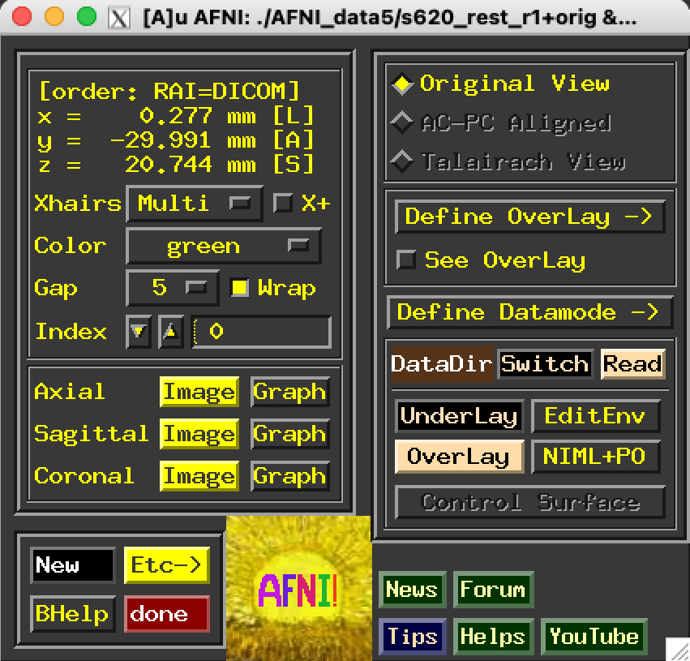

.. _afni03_interactive:

****************************
**Using AFNI Interactively**
****************************

.. contents::
   :depth: 2

Start AFNI from the command line
================================

* ``afni`` reads datasets from the current directory.
    * If no datasets in current directory, tries to read sub-directories 1 level deeper.
* ``afni dir1 dir2 ...`` reads datasets from directories listed.
* ``afni -R`` reads datasets from the current directory and from all directories below it.

.. note:: AFNI reads the file named .afnirc from your home directory, if it is present.
          This file is used to change many of the defaults (cf. File README.environment)

 
Miscellaneous features of the AFNI controller window
====================================================

.. table::
   :align: center
   :widths: auto
+----------------------------------------------------------------------------+-------------------------------------------------------------------+
|* xyz-coordinate display in upper left corner shows current focus location  |.. image:: media/afni03_interactive/afni_controller_window_xyz.png |
|                                                                            |           :width: 90%                                             |
|                                                                            |           :align: right                                           |
|* By default, the coordinates are in RAI order (from the DICOM standard):   |                                                                   |
|    * x = Right (negative) to Left (positive)                               |                                                                   |
|    * y = Anterior (negative) to Posterior (positive)                       |                                                                   |
|    * z = Inferior (negative) to Superior (positive)                        |                                                                   |
|* This display order can be changed to the neuroscience imaging order LPI:  |                                                                   |
|    * x = Left (negative) to Right (positive)                               |                                                                   |
|    * y = Posterior (negative) to Anterior (positive)                       |                                                                   |
|    * z = Inferior (negative) to Superior (positive)                        |                                                                   |
|    * Right-click in coordinate display to change the coordinate order      |                                                                   |
+----------------------------------------------------------------------------+-------------------------------------------------------------------+

.. table::
   :align: center
   :widths: auto
+-------------------------------------------------------------------------------+--------------------------------------------------------------------------+
|* The [BHelp] button: when pressed, the cursor changes to a hand shape         |.. image:: media/afni03_interactive/afni_controller_window_bhelp_done.png |
|    * use it to click on any AFNI button and you will get a small help popup   |           :width: 90%                                                    |
|    * AFNI also has ‘hints’ (AKA ‘tooltips’)                                   |           :align: right                                                  |
|* Press the [done] button twice within 5 seconds to exit AFNI                  |                                                                          |
|    * The first button press changes ‘done’ to ‘DONE’                          |                                                                          |
|    * Fail to press second time in 5 seconds: it changes back to ‘done’        |                                                                          |
|    * Don’t press a mouse button in the blank square to the right of [done]    |                                                                          |
|    * We won’t be responsible for the consequences                             |                                                                          |
+-------------------------------------------------------------------------------+--------------------------------------------------------------------------+

