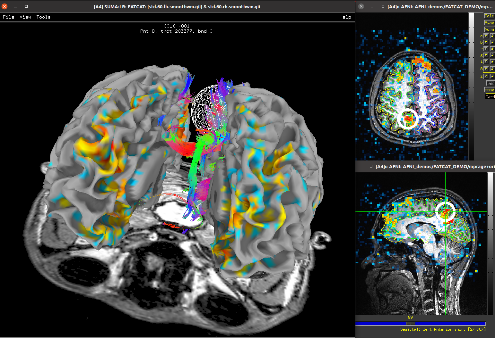

:tocdepth: 2

.. _start_intro:

=====================
Starting with AFNI
=====================

.. contents::
   :local:

Overview
----------

*Welcome to the AFNI software toolbox.* AFNI (Analysis of Functional
NeuroImages) is a suite of programs for looking at and analyzing MRI
brain images at all stages of analysis (planning, setting up
acquisiton, preprocessing, analysis, quality control and statistical
analysis).  It contains C, Python and R programs, as well as shell
scripts.

The philosophy driving AFNI development is simple: **help keep users
close to their data.**

AFNI is primarily developed for the processing, analysis and display
of multiple MRI modalities:

* **anatomical/structural MRI**

  * at various field strengths

* **diffusion weighted imaging (DWI)**

  * for DTI or HARDI modeling and tractography (using the FATCAT
    programs)

* **functional MRI (FMRI)**

  * resting state, task-based or naturalistic paradigms

  * single- or multi-echo acquisitions

  * voxelwise or ROI-based analyses, volumetric or surface-based

  * convenient+efficient pipeline design with ``afni_proc.py``

Many AFNI programs have also been applied and adapted to other
modalities, such as ECoG, EEG, MEG, and more.

AFNI can be used for volumetric or surface analyses, as well as their
combination, and has been applied widely across studies of humans,
NHP and other species.

Where to begin
---------------

Below we provide a quick roadmap through the AFNI toolbox, including
educational resources, reference links, demo examples (with
data+scripts) and more.  Note: these are just subsets of the material
here, which we encourage exploring.

**Installation instructions**

* | :ref:`Installation instructions per OS <install_main>`

* | :ref:`Docker container notes <install_container_build>`

**Bootcamp and video lectures**

* `AFNI Academy series: lectures based on the AFNI Bootcamp, combining
  theory and hands-on examples <https://www.youtube.com/c/afnibootcamp>`_

* :ref:`Additional Bootcamp recordings <edu_bcamp>`
    
* :ref:`Links to AFNI handouts (part of Bootcamp), GUI keyboard
  shortcuts and startup tips (and more) <edu_main>`

* :ref:`Quick Unix tutorial <U_all>`

**Program listings and helps**

* :ref:`"Classified" program guide: list of AFNI programs grouped
  thematically <edu_class_prog>`

* :ref:`Mega-page linking to all program helps <programs_main>`

**Code, command, script and functionality examples**

* :ref:`Tutorial examples, scripts and demos <tut_main>`

* :ref:`Publication-based code examples (AFNI Codex) <codex_main>`

* :ref:`Statistics notes on various programs <statistics_main>`

**Additional resources**

* :ref:`Methods publications (read the backstory of various code
  pieces) and reference list <pubcit_citations>`

* :ref:`Nonhuman projects and processing (with demos) <nhp_main>`
    
* :ref:`Templates and atlases <templates_main>`

**Code-centric**

* `AFNI github page <https://github.com/afni/afni>`_

* :ref:`Notes on making a pull request (PR) <devdocs_pr_pr_ex>`

Asking questions and following updates
--------------------------------------------------------

We are happy to answer questions, receive suggestions, and generally
discuss data analysis on the `AFNI Message Board
<https://afni.nimh.nih.gov/afni/community/board/login.php?1>`_

Additionally, please consider signing up for the `AFNI Digest
<https://list.nih.gov/cgi-bin/wa.exe?SUBED1=afni_digest&A=1>`_.  This
approximately weekly (or so) emailer contains developments or changes
within the AFNI realm that we deem large enough for wide
dissemination.  We will also broadcast things like Bootcamp info;
installation and build instruction changes; processing commentary; and
perhaps dollops of humor.
