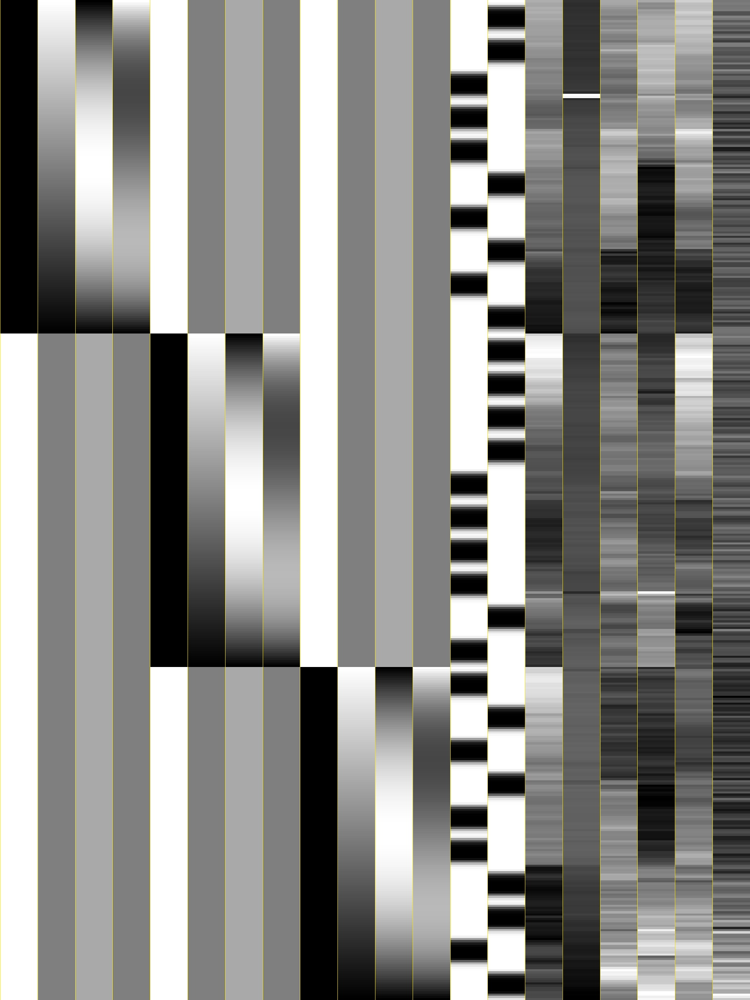

.. _stats_decon2004:

******************************************************
**Some 3dDeconvolve Notes**
******************************************************

.. contents:: :local:

Overview
++++++++

These are notes by Bob Cox, from the great ``3dDeconvolve`` Upgrades
of 2004 and 2007. This page contains notes on various features added in that
happy time.

Sections below will contain comments on underlying algorithms, option
usage, and other words of wisdom that might be useful.

The current help page is for ``3dDeconvolve`` is `here. <https://afni.nimh.nih.gov/pub/dist/doc/htmldoc/programs/alpha/3dDeconvolve_sphx.html#ahelp-3ddeconvolve/>`_

The original 2004 notes page is `here. <https://afni.nimh.nih.gov/pub/dist/doc/misc/Decon/DeconSummer2004.html>`_

The original 2007 notes page is `here. <https://afni.nimh.nih.gov/pub/dist/doc/misc/Decon/DeconSpring2007.html>`_

``3dDeconvolve`` Upgrades Summer 2004
+++++++++++++++++++++++++++++++++++++

.. _stats_decon2004_svd:

SVD for X-matrix pseudoinverse
==============================

Gaussian elimination on the normal equations of X has been replaced by
using the SVD to compute the X matrix pseudoinverse. This can be
disabled using the ``-nosvd`` option. If the SVD solution is on, then
all-zero ``-stim_file`` functions will NOT be removed from the analysis
(unlike the ``-nosvd`` analysis).

The reason for not removing the all-zero regressors is so that GLTs
and other scripts that require knowing where various results are in
the output can still function.

* One plausible case that can give all-zero regressors: a task with
  "correct" and "incorrect" results, you analyze these cases
  separately, but some subjects are so good they don't have any
  incorrect responses.

The SVD solution will set the coefficient and statistics for an
all-zero regressor to zero.

If two identical (nonzero) regressors are input, the program will
complain but continue the analysis. In this case, each one would get
half the coefficient, which only seems fair. However, your
interpretation of such cases should be made with caution.

For those of you who aren't mathematicians: the SVD solution basically
creates the orthogonal principal components of the columns of the X
matrix (the baseline and stimulus regressors), and then uses those to
solve the linear system of equations in each voxel.

.. _stats_decon2004_xmat_condition:

X-matrix condition numbers
==========================

The X matrix condition number is now computed and printed. This can be
disabled using the ``-nocond`` option. As a rough guide, if the matrix
condition number is about 10^p, then round off errors will cause about p
decimal places of accuracy to be lost in the calculation of the
regression parameter estimates. In double precision, a condition
number more than 10^7 would be worrying. In single precision, more than
1000 would be cause for concern. Note that if Gaussian elimination is
used, then the effective condition number is squared (twice as bad in
terms of lost decimal places); this is why the SVD solution was
implemented.

* The condition number is the ratio of the largest to the smallest
  singular value of X. If Gaussian elimination is used (``-nosvd``; see
  :ref:`here <stats_decon2004_svd>`), then this ratio is squared.

.. comment: this factoid no longer applies at all, because we don't
   build+distribute 3dDeconvolve_f anymore

   Use of ``3dDeconvolve_f`` (single precision program) now requires
   "informed consent" from the user, indicated by putting the option
   "-OK" first on the command line. This is because roundoff error can
   cause big errors in single precision if the matrix condition number
   is over 1000.

.. _stats_decon2004_xjpeg:

``-xjpeg``
==========

The new ``-xjpeg filename`` option will save a JPEG image of the columns of 
the regression matrix X into the given file. 
(image below is from the boot camp example)

* Each column is scaled separately, from white=minimum to black=maximum.
* Environment variable ``AFNI_XJPEG_COLOR`` determine the colors of the lines 
  drawn between the columns. 
  
  * The color format is ``rgbi:rf/gf/bf``, where each value rf,gf,bf is a 
    number between 0.0 and 1.0 (inclusive). 
  * For example, yellow would be ``rgbi:1.0/1.0/0.0``. 
  * As a special case, if this value is the string ``none`` or ``NONE``, 
    then these lines will not be drawn.
  * This webpage is handy for getting color codes: 
    https://rgbcolorpicker.com/0-1. (just ignore the "a" (alpha) value)

* Environment variable ``AFNI_XJPEG_IMXY`` determines the size of the 
  image saved when via the ``-xjpeg`` option to ``3dDeconvolve``. 
* It should be in the format AxB:

  * ``A`` is the number of pixels the image is to be wide. 
    (across the matrix rows)
  * ``B`` is the number of pixels high (down the columns); for example:

    .. code-block::
    
       setenv AFNI_XJPEG_IMXY 768x1024

* Which means to set the x-size (horizontal) to 768 pixels and the y-size 
  (vertical) to 1024 pixels. These values are the default, by the way.

* If the first value ``A`` is negative and less than -1, its absolute value 
  is the number of pixels across PER ROW. 
* If the second value ``B`` is negative, its absolute value is the number of 
  pixels down PER ROW. 
* Usually there are many fewer columns than rows.

.. _stats_decon2004_warnings:

Warnings
========

* ``3dDeconvolve`` now checks for duplicate ``-stim_file`` names, and duplicate 
  matrix columns. Only warning messages are printed -- these are not fatal 
  errors (at least, if the SVD solution is on).

.. _stats_decon2004_mat_inputs:

Matrix Inputs
=============

* Matrix inputs for the ``-glt`` option can now use a notation like ``30@0`` to
  indicate that 30 0s in a row are to be placed on the line. For example, if you
  have 10 runs catenated together, and you used ``-polort 2``, then there are 30
  baseline parameters to skip (usually) when specifying each GLT row; a sample
  matrix file with 34 entries per row is below:

  +------+---+----+---+----+
  | 30@0 | 1 | -1 | 0 |  0 |
  +------+---+----+---+----+
  | 30@0 | 0 |  0 | 1 | -1 |
  +------+---+----+---+----+

.. _stats_decon2004_gltsym:

``-gltsym``
===========

The new ``-gltsym gltname`` option lets you describe the rows of a GLT matrix
using a symbolic notation. 

* Each stimulus is symbolized by its ``-stim_label`` option. 
* Each line in the ``gltname`` file corresponds to a row in the GLT matrix.
* On each line should be a set of stimulus symbols, which can take the following
  forms (using the label ``Stim`` as the examplar):

.. list-table::
   :widths: 20 80
   :align: left

   * - ``Stim``
     - put +1 in the matrix row for each lag of ``Stim``
   * - ``+Stim``
     - put +1 in the matrix row for each lag of ``Stim`` (same as above)
   * - ``-Stim``
     - put -1 in the matrix row for each lag of ``Stim``
   * - ``Stim[2..7]``
     - put +1 in the matrix for lags 2..7 of ``Stim``
   * - ``3*Stim[2..7]``
     - put +3 in the matrix for lags 2..7 of ``Stim``
   * - ``Stim[[2..4]]``
     - put +1 in the matrix for lags 2..4 of ``Stim`` in 3 successive rows of 
       the matrix, as in:

       +---+---+---+---+---+---+---+---+
       | 0 | 0 | 1 | 0 | 0 | 0 | 0 | 0 |
       +---+---+---+---+---+---+---+---+
       | 0 | 0 | 0 | 1 | 0 | 0 | 0 | 0 |
       +---+---+---+---+---+---+---+---+
       | 0 | 0 | 0 | 0 | 1 | 0 | 0 | 0 |
       +---+---+---+---+---+---+---+---+

       whereas ``Stim[2..4]`` would yield one matrix row

       +---+---+---+---+---+---+---+---+
       | 0 | 0 | 1 | 1 | 1 | 0 | 0 | 0 |
       +---+---+---+---+---+---+---+---+

There can be no spaces or ``*`` characters in the stimulus symbols; each set
of stimulus symbols on a row should be separated by one or more spaces. For
example, the two multi-lag regressors entered with the options below.

.. code-block::

   -stim_label 1 Ear -stim_minlag 1 0 -stim_maxlag 1 5 \
   -stim_label 2 Wax -stim_minlag 2 2 -stim_maxlag 2 7

This could have a GLT matrix row specified by:

.. code-block::

   +Ear[2..5] -Wax[4..7]

Which would translate into a matrix row like (zeros for the baseline):

.. code-block::

   0 0 1 1 1 1 0 0 -1 -1 -1 -1

* With ``-gltsym``, you do not have to specify the number of rows on the command
  line -- the program will determine that from the file.
* You can embed comment lines in the file -- these are lines that start with the
  characters ``#`` or ``//``.
* If you want to access the polynomial baseline parameters for some bizarre
  reason, you can use the symbolic name ``Ort``; otherwise, the GLT matrix
  elements corresponding to these parameters will all be set to 0, as in the
  example above.
* A GLT can be expressed directly on the command line with an option of the
  form:

  .. code-block::
  
     -gltsym 'SYM: +Ear[2..5] -Wax[4..7]'

  where the ``SYM:`` that starts the string indicates that the rest of the
  string should be used to define the 1 row matrix. It is important that this
  string be enclosed in forward single quotes, as shown. If you want to have
  multiple rows specified, use the ``\`` character to mark the end of each row,
  as in:

  .. code-block::

     -gltsym 'SYM: +Ear[2..5] \ -Wax[4..7]'

* You probably want to use the ``-glt_label`` option with ``-gltsym``, as with 
  ``-glt``.
* If you want to have the matrices generated by ``-gltsym`` printed to the 
  screen, you can set environment variable ``AFNI_GLTSYM_PRINT`` to ``YES``.

.. _stats_decon2004_Legendre:

Legendre Polynomials
====================

Polynomial baseline functions now default to Legendre polynomials, which are
more pleasantly behaved than the older power baseline functions. If you need the
old power functions, you must use the ``-nolegendre`` option; this should only
be the case if you use the baseline parameter estimates for some purpose.

* For each block of contiguous data, the time range from first to last is scaled
  to the interval ``[-1,1]``. The standard Legendre polynomials P\ :sub:`n`\ (x)
  are then entered as baseline regressors, for ``n=0,1,...``

.. _stats_decon2004_cbucket:

``-cbucket``
============

You can save ONLY the estimated parameters (AKA regression coefficients) for
each voxel into a dataset with the new ``-cbucket cprefix`` option. This may be
useful if you want to do some calculations with these estimates; you won't have
to extract them from the various statistics that are stored in the output of the
``-bucket bprefix`` option.

.. _stats_decon2004_cbucket:

``-xsave``
==========

In combination with the old ``-bucket bprefix`` option, the new ``-xsave``
option saves the X matrix (and some other information) into file
``bprefix.xsave``. Use this option when you first run ``3dDeconvolve``, if you
think you might want to run some extra GLTs later, using the ``-xrestore``
option (below) -- this is usually much faster than running the whole analysis
over from scratch.

.. _stats_decon2004_xrestore:

``-xrestore``
=============

The new ``-xrestore filename.xsave`` option will read the ``-xsave`` file and
allow you to carry out extra GLTs after the first ``3dDeconvolve`` run. When you
use ``-xrestore``, the only other options that have effect are ``-glt``,
``-glt_label``, ``-gltsym``, ``-num_glt``, ``-fout``, ``-tout``, ``-rout``,
``-quiet``, and ``-bucket``. All other options on the command line will be
ignored (silently). The original time series dataset (from ``-input``) is named
in the ``-xsave`` file, and must be present for ``-xrestore`` to work. If the
parameter estimates were saved in the original ``-bucket`` or ``-cbucket``
dataset, they will also be read; otherwise, the estimates will be re-computed
from the voxel time series as needed. The new output sub_bricks from the new
``-glt`` options will be stored as follows:

* No ``-bucket`` option given in the ``-xrestore`` run will be stored at end of
  original ``-bucket`` dataset.
* ``-bucket bbb`` option given in the ``-xrestore`` run will be stored in
  dataset with prefix "bbb", which will be created if necessary; if "bbb"
  already exists, new sub-bricks will be appended to this dataset.

.. _stats_decon2004_input:

``-input``
==========

The ``-input`` option now allows input of multiple 3D+time datasets, as in:

.. code-block::
    
   -input fred+orig ethel+orig lucy+orig ricky+orig

Each command line argument after ``-input`` that does NOT start with a ``-``
character is taken to be a new dataset. These datasets will be catenated
together in time (internally) to form one big dataset. Other notes:

* You must still provide regressors that are the full length of the catenated
  imaging runs; the program will NOT catenate files for the ``-input1D``,
  ``-stim_file``, or ``-censor`` options.
* If this capability is used, the ``-concat`` option will be ignored, and the
  program will use time breakpoints corresponding to the start of each dataset
  from the command line.

.. _stats_decon2004_progress:

Progress Meter
==============

Unless you use the ``quiet`` option, ``3dDeconvolve`` now prints a "progress
meter" while it runs. When it is done, this will look as below where each digit
is printed when 2% of the voxels are done.

.. code-block::

   ++ voxel loop:0123456789.0123456789.0123456789.0123456789.0123456789.

.. _stats_decon2004_stim_times:

``-stim_times``
===============

Direct input of stimulus timing, plus generation of a response model, with the
new ``-stim_times`` option:

.. code-block::

   -stim_times k tname rtype

k and tname
-----------

``k`` is the stimulus index (from 1 to the ``-num_stimts`` value).

``tname`` is the name of the file that contains the stimulus times (in units
of seconds, as in the TR of the ``-input`` file). There are two formats for
this file.

1. A single column of numbers, in which case each time is relative to the start
   of the first imaging run ("global times").
2. If there are ``R`` runs catenated together (either directly on the command
   line, or as represented in the ``-concat`` option), the second format is to
   give the times within each run separately. In this format, the input file
   tname would have ``R`` rows, one per run; the times for each run take up
   one row. For example, with R=2:

   .. code-block::

      12.3 19.8 23.7 29.2 39.8 52.7 66.6
      21.8 32.7 41.9 55.5
     
   These times will be converted to global times by the program, by adding the
   time offset for each imaging run. 
   
   N.B.: The times are relative to the start
   of the data time series as input to ``3dDeconvolve``. If the first few points
   of each imaging run have been cut off, then the actual stimulus times must be
   adjusted correspondingly (e.g., if 2 time points were excised with TR=2.5,
   then the actual stimulus times should be reduced by 5.0 before being input to
   ``3dDeconvolve``).

3. When using the multi-row input style, you may have the situation where the
   particular class of stimulus does not occur at all in a given imaging run. To
   encode this, the corresponding row of the timing file should consist of a
   single ``*`` character; for example, if there are 4 imaging runs but the kth
   stimulus only occurs in runs 2 and 4, then the ``tname`` file would look
   something like this:

   .. code-block::
      
      *
      3.2 7.9 18.2 21.3
      *
      8.3 17.5 22.2

4. In the situation where you are using multi-row input, AND there is at most
   one actual stimulus per run, then you might think that the correct input
   would be something like:

   .. code-block::

      *
      *
      30
      *

   **However, this will be confused with the 1 column format, which means global
   times, and so this is wrong. Instead, you can put an extra * on one line
   with an actual stimulus, and then things will work OK:**

   .. code-block::

      *
      *
      30 *
      *

rtype
-----

This allows you to play the game R-Type originally released in arcades back in 
1987. `See here. <https://en.wikipedia.org/wiki/R-Type>`_.

This is not to be confused with the ``Type R`` which is the performance editions
of certain Honda models.
`See here. <https://en.wikipedia.org/wiki/Honda_Type_R>`_.

All joking aside, ``rtype`` specifies the type of response model that is to
follow each stimulus. The following formats for ``rtype`` are recognized:
**THERE ARE OTHER AND MORE MODERN TYPES AVAILABLE. 
SEE THE CURRENT HELP** 
`HERE <https://afni.nimh.nih.gov/pub/dist/doc/htmldoc/programs/alpha/3dDeconvolve_sphx.html#ahelp-3ddeconvolve>`_.

1. ``'GAM'`` is the response function h\ :sub:`G`\(t;b,c) = (t/(bc))\ :sup:`b`\
   exp(b-t/c) for the Cohen parameters b=8.6, c=0.547. This function peaks at
   the value 1 at t=bc, and is the same as the output of ``waver -GAM``.
   See `here for waver <https://afni.nimh.nih.gov/pub/dist/doc/htmldoc/programs/alpha/waver_sphx.html#ahelp-waver>`_.

   .. list-table::
      :widths: 50 50
      :header-rows: 1
   
      * - ``GAM`` output from ``-xjeg``
        - ``GAM`` output from ``1dplot``
      * - .. image:: media/GAM_x.jpg
             :width: 50%
             :align: center
        - .. image:: media/GAM_1d.jpg
             :width: 90%
             :align: center
   
   Plot generated with:

   .. code-block::

      3dDeconvolve -nodata 200 1.0 -num_stimts 1 -polort -1 -xjpeg gam_x.jpg \
                  -local_times -x1D stdout:                      \
                  -stim_times 1 '1D: 10 60 110 170' 'GAM'        \
      | 1dplot -THICK -one -stdin -xlabel Time  -jpg GAM_1d.jpg  \
               -DAFNI_1DPLOT_COLOR_01=red 

----

|

2. ``'GAM(b,c)'`` is the same response function as above, but where you give the
   'b' and 'c' values explicitly. The ``GAM`` response models have 1 regression
   parameter per voxel (the amplitude of the response).

   .. list-table::
      :widths: 50 50
      :header-rows: 1
   
      * - ``GAM(b,c)`` output from ``-xjeg``
        - ``GAM(b,c)`` output from ``1dplot``
      * - .. image:: media/GAMbc_x.jpg
             :width: 50%
             :align: center
        - .. image:: media/GAMbc_1d.jpg
             :width: 90%
             :align: center
   
   Plot generated with:

   .. code-block::

      3dDeconvolve -nodata 200 1.0 -num_stimts 1 -polort -1 -xjpeg GAMbc_x.jpg \
             -local_times -x1D stdout:                  \
             -stim_times 1 '1D: 10 60 110 170' 'GAM(10,2)'  \
      | 1dplot -THICK -one -stdin -xlabel Time -jpg GAMbc_1d.jpg \
               -DAFNI_1DPLOT_COLOR_01=red 

----

|

3. ``'SPMG2'`` is the  SPM gamma variate regression model, which has 2 regression
   parameters per voxel. The basis functions are:

   * h\ :sub:`SPM,1`\(t) = exp(-t) [ t\ :sup:`5`\/12 - t\ :sup:`15`\/(6*15!) ]
   * h\ :sub:`SPM,2`\(t) = d/dt [ h\ :sub:`SPM,1`\(t) ]

   .. list-table::
      :widths: 50 50
      :header-rows: 1
   
      * - ``SPMG2`` output from ``-xjeg``
        - ``SPMG2`` output from ``1dplot``
      * - .. image:: media/SPMG2_x.jpg
             :width: 50%
             :align: center
        - .. image:: media/SPMG2_1d.jpg
             :width: 90%
             :align: center

   Plot generated with:
   
   .. code-block::

      3dDeconvolve -nodata 200 1.0 -num_stimts 1 -polort -1 -xjpeg SPMG2_x.jpg \
             -local_times -x1D stdout:                  \
             -stim_times 1 '1D: 10 60 110 170' 'SPMG2'  \
      | 1dplot -THICK -one -stdin -xlabel Time -jpg SPMG2_1d.jpg 

----

4. ``'TENT(b,c,n)'`` is a tent function deconvolution model, ranging between
   times ``s+b`` and ``s+c`` after each stimulus time ``s``, with n basis
   functions (and n regression parameters per voxel).

   * A 'tent' function is just the colloquial term for a 'linear B-spline'. That
     is tent(x) = max( 0 , 1-\|x\| )
   * A 'tent' function model for the hemodynamic response function is the same
     as modeling the HRF as a continuous piecewise linear function. Here, the
     input 'n' is the number of straight-line pieces.

   .. list-table::
      :widths: 50 50
      :header-rows: 1
   
      * - ``TENT(b,c,n)`` output from ``-xjeg``
        - ``TENT(b,c,n)`` output from ``1dplot``
      * - .. image:: media/TENT_x.jpg
             :width: 50%
             :align: center
        - .. image:: media/TENT_1d.jpg
             :width: 90%
             :align: center

   Plot generated with:
   
   .. code-block::

      3dDeconvolve -nodata 200 1.0 -num_stimts 1 -polort -1 -xjpeg TENT_x.jpg \
             -local_times -x1D stdout:                  \
             -stim_times 1 '1D: 10 60 110 170' 'TENT(3,30,3)'  \
      | 1dplot -thick -one -stdin -xlabel Time -jpg TENT_1d.jpg

----

5. ``'CSPLIN(b,c,n)'`` is a cubic spline deconvolution model; similar to the
   ``TENT`` model, but where smooth cubic splines replace the non-smooth tent
   functions.

   .. list-table::
      :widths: 50 50
      :header-rows: 1
   
      * - ``CSPLIN(b,c,n)`` output from ``-xjeg``
        - ``CSPLIN(b,c,n)`` output from ``1dplot``
      * - .. image:: media/CSPLIN_x.jpg
             :width: 50%
             :align: center
        - .. image:: media/CSPLIN_1d.jpg
             :width: 90%
             :align: center

   Plot generated with:
   
   .. code-block::

      3dDeconvolve -nodata 200 1.0 -num_stimts 1 -polort -1 -xjpeg CSPLIN_x.jpg \
             -local_times -x1D stdout:                  \
             -stim_times 1 '1D: 10 60 110 170' 'CSPLIN(1,30,4)'  \
      | 1dplot -thick -one -stdin -xlabel Time -jpg CSPLIN_1d.jpg

----

6. ``'SIN(b,c,n)'`` is a sin() function deconvolution model, ranging between
   times s+b and s+c after each stimulus time s, with n basis functions (and n
   regression parameters per voxel). The qth basis function, for q=1..n, is h\
   :sub:`SIN,q`\(t) = sin(qπ(t-b)/(c-b)).

   .. list-table::
      :widths: 50 50
      :header-rows: 1
   
      * - ``SIN(b,c,n)`` output from ``-xjeg``
        - ``SIN(b,c,n)`` output from ``1dplot``
      * - .. image:: media/SIN_x.jpg
             :width: 50%
             :align: center
        - .. image:: media/SIN_1d.jpg
             :width: 90%
             :align: center

   Plot generated with:
   
   .. code-block::

      3dDeconvolve -nodata 200 1.0 -num_stimts 1 -polort -1 -xjpeg SIN_x.jpg \
             -local_times -x1D stdout:                  \
             -stim_times 1 '1D: 10 60 110 170' 'SIN(1,30,2)'  \
      | 1dplot -thick -one -stdin -xlabel Time -jpg SIN_1d.jpg

----

7. ``'POLY(b,c,n)'`` is a polynomial function deconvolution model, ranging
   between times s+b and s+c after each stimulus time s, with n basis functions
   (and n regression parameters per voxel). The qth basis function, for q=1..n,
   is h\ :sub:`POLY,q`\(t) = P\ :sub:`q`\(2(t-b)/(c-b)-1) 
   where P\ :sub:`q`\(x) is the qth Legendre polynomial.

   .. list-table::
      :widths: 50 50
      :header-rows: 1
   
      * - ``POLY(b,c,n)`` output from ``-xjeg``
        - ``POLY(b,c,n)`` output from ``1dplot``
      * - .. image:: media/POLY_x.jpg
             :width: 50%
             :align: center
        - .. image:: media/POLY_1d.jpg
             :width: 90%
             :align: center

   Plot generated with:
   
   .. code-block::

      3dDeconvolve -nodata 200 1.0 -num_stimts 1 -polort -1 -xjpeg POLY_x.jpg \
             -local_times -x1D stdout:                  \
             -stim_times 1 '1D: 10 60 110 170' 'POLY(1,30,3)'  \
      | 1dplot -thick -one -stdin -xlabel Time -jpg POLY_1d.jpg

----

8. ``'BLOCK(d,p)'`` is a block stimulus of duration d starting at each stimulus
   time.

   * The basis block response function is the convolution of a gamma variate
     response function with a 'tophat' function:

     * H(t) = ∫\ :sub:`0`\ :sup:`min(t,d)`\ h(t-s) ds where h(t) = (t/4)\ :sup:`4`\ exp(4-t)
       * h(t) peaks at t=4 with h(4)=1, whereas H(t) peaks at t=d/(1-exp(-d/4).
         Note that the peak value of H(t) depends on 'd'; call this peak value
         H :sub:`peak`\(d).
   * ``'BLOCK(d)'`` means that the response function to a stimulus at time s is
     H(t-s) for t=s..s+d+15.
   * ``'BLOCK(d,p)'`` means that the response function to a stimulus at time s
     is p⋅H(t-s)/H\ :sub:`peak`\(d) for t=s..s+d+15. That is, the response is
     rescaled so that the peak value of the entire block is 'p' rather than 
     H\ :sub:`peak`\(d). For most purposes, the best value would be p=1.
   * ``'BLOCK'`` is a 1 parameter model (the amplitude).

   .. list-table::
      :widths: 50 50
      :header-rows: 1
   
      * - ``BLOCK(d,p)`` output from ``-xjeg``
        - ``BLOCK(d,p)`` output from ``1dplot``
      * - .. image:: media/BLOCK_x.jpg
             :width: 50%
             :align: center
        - .. image:: media/BLOCK_1d.jpg
             :width: 90%
             :align: center

   Plot generated with:
   
   .. code-block::

      3dDeconvolve -nodata 200 1.0 -num_stimts 1 -polort -1 -xjpeg BLOCK_x.jpg \
             -local_times -x1D stdout:                  \
             -stim_times 1 '1D: 10 60 110 170' 'BLOCK(20,1)'  \
      | 1dplot -thick -one -stdin -xlabel Time -jpg BLOCK_1d.jpg \
               -DAFNI_1DPLOT_COLOR_01=red 

----

|

9. ``'EXPR(b,c) exp1 exp2 ...'`` is a set of user-defined basis functions,
   ranging between times s+b and s+c after each stimulus time s. The expressions
   are given using the syntax of ``3dcalc``, and can use the symbolic variables:

   * ``'t'`` = time from stimulus
   * ``'x'`` = t scaled to range from 0 to 1 over the b..c interval
   * ``'z'`` = t scaled to range from -1 to 1 over the b..c interval
   * An example, which is equivalent to ``'SIN(0,35,3)'``, is ``'EXPR(0,35)
     sin(PI*x) sin(2*PI*x) sin(3*PI*x)'``. Expressions are separated by blanks,
     and must not contain whitespace themselves. An expression must use at least
     one of the symbols 't', 'x', or 'z', unless the entire expression is the
     single character "1".

----

The basis functions defined above are not normalized in any particular way. The
``-basis_normall`` option can be used to specify that each basis function be
scaled so that its peak absolute value is a constant. For example
``-basis_normall 1`` will scale each function to have amplitude 1. Note that
this scaling is actually done on a very fine grid over the entire domain of t
values for the function, and so the exact peak value may not be reached on any
given point in the actual FMRI time series.

* Note that it is the basis function that is normalized, *not* the convolution
  of the basis function with the stimulus timing!
* The ``-basis_normall`` option must be given *before* any ``-stim_times``
  options to which you want it applied!

If you use a ``-iresp`` option to output the hemodynamic (impulse) response
function corresponding to a ``-stim_times`` option, this function will be
sampled at the rate given by the new ``-TR_times`` dt option. The default value
is the TR of the input dataset, but you may wish to plot it at a higher time
resolution. (The same remarks apply to the ``-sresp`` option.)

Since the parameters in most models do not correspond directly to amplitudes of
the response, care must be taken when using GLTs with these.

* The parameters for ``GAM``, ``TENT``, ``CSPLIN``, and ``BLOCK`` do corresond
  directly to FMRI signal change amplitudes.
* **I NEED TO THINK THIS THROUGH SOME MORE** (Says Bob)

Next to be implemented (someday): an option to compute areas under the curve
from the basis-function derived HRFs.

-----

More changes are on the way - RWCox - 22 Sep 2004 - Bilbo and Frodo Baggins'
birthday!

-----

The ``-nodata`` option now works with the ``-stim_times`` option.

* However, since ``-stim_times`` needs to know the number of time points (NT)
  and the time spacing (TR), you have to supply these values after the
  ``-nodata`` option if you are using ``-stim_times``.
* For example: ``-nodata 114 2.5`` to indicate 114 points in time with a spacing
  of 2.5 s.

.. _stats_decon2007:

Spring 2007 Changes to ``3dDeconvolve``
+++++++++++++++++++++++++++++++++++++++

.. _stats_decon2007_small:

Small changes: to the defaults, new options, *etc*.
===================================================

* ``-nobout`` and ``-full_first`` are now the defaults. These changes mean that
  if you *want* the β weights for the baseline parameters in the output
  ``-bucket`` dataset, you have to specify -bout on the command line. If you
  *want* the full-model statistics to appear last in the dataset, you have to
  specify ``-nofull_first`` on the command line.
|
* Even if you do not give the ``-fout`` option on the command line (indicating you
  do *not* want *F*-statistics for various hypotheses to be calculated), the program
  will still compute the full model *F*-statistics. If you don't want that for
  some reason, you have to use the new ``-nofullf_atall`` option.
| 
* If you do not give a ``-bucket`` option on the command line, then the program
  will act as if you had given ``-bucket Decon``. (This is known as the "Ah need
  a bucket" change, with apologies to KFC.)
|
* The program now *always* outputs (to a file) the regression matrix **X**, even
  if you don't give a ``-x1D`` option. The default filename will be the same as
  the ``-bucket`` prefix, with the suffix ``.x1D`` added.

  * The matrix file format has been slightly altered to store column labels in
    XML-style comments in the header. (Previously, the matrix was just written
    out as an array of unlabeled numbers.) These labels will be useful in an
    upcoming regression matrix analysis program being planned by Ziad Saad. They
    are also useful in the new program ``3dSynthesize`` (cf. *infra*).
| 
* ``3dDeconvolve`` used to fail with the ``-nodata`` option combined with
  ``-stim_times``. This crash should be a thing of the past.

  * When using ``-nodata``, the program needs to know the length of the
    (non-existent) imaging data (number of TRs) and it also needs to know the
    TR. The simplest and best way to specify these values is to put them
    immediately after the ``-nodata`` option; for example ``-nodata 300 2.5`` to
    indicate 300 time points with TR=2.5 s.
  * If you don't do the above, then if you use ``-nlast``, that value (+1) will
    be used as the number of TRs. If you don't give the TR in some way, then the
    default ``-nodata`` TR is 1.0 s. This TR is unimportant if you only use
    ``-stim_file``, but is crucial if you use ``-stim_times`` with ``-nodata``
    or with ``-input1D``.
|

* New option ``-float`` (or ``-datum float``) can be used to make all the output
  datasets be stored in floating point format. In the past, only scaled shorts
  were possible, and the limited (16-bit) precision of these sometimes caused
  problems. Shorts are still the default, but at some point in the future I may
  change the default to floats — if/when this happens, the option ``-short`` can
  be used if you like the more compact format.
|
* The program now reports when ``-stim_times`` time values are out of the time
  span of the dataset. These are not fatal errors, but can help notify you to
  potential problems of your timing files. (This problem is known as the PSFB
  syndrome — it's not as bad as the Mike Beauchamp syndrome, but try to avoid
  it.)
|
* The labels for the ``-bucket`` output dataset sub-bricks have been changed
  slightly to be more consistent and readable (e.g., ``Tstat`` instead of
  ``t-st`` to indicate a *t*-statistic).
|
* ``3dDeconvolve`` now computes a recommended ``-polort`` value (1 degree for
  every 150 s of continuous imaging). If your input value is less than this, a
  non-fatal WARNING message is printed. If you use ``-polort A``, then the
  program will automatically choose the polynomial degree to use for detrending
  (AKA high pass filtering).
|
* A new ``CSPLIN()`` model for ``-stim_times`` is now available. This function
  is a drop-in replacement for ``TENT()``, with the same 3 arguments. The basis
  functions are cardinal cubic splines, rather than cardinal linear splines.
  ``CSPLIN()`` will produce smoother looking HRF curves, if plotted with
  ``-TR_times`` less than the dataset TR. (As always, if you are going to change
  your analysis methodology, run some data the old way and the new way, then
  compare the results to make sure you understand what is happening!)

.. _stats_decon2007_goforit:

Detection and processing of matrix errors; new ``-GOFORIT`` option
==================================================================

* ``3dDeconvolve`` now makes several more checks for "bad things" in the
  regression matrix.

  * Besides checking the full matrix condition number, it also checks several
    sub-matrices: the signal sub-model, the baseline sub-model, the ``-polort``
    sub-model, and the ``-stim_base`` sub-model.
  * Each check is printed out and labeled as to how good the program "thinks" it
    is. Potentially bad values are flagged with ** **BEWARE** **

  * **N.B.**: ``3dDeconvolve``'s condition number is *not* exactly the same as
    that computed by Matlab. ``3dDeconvolve`` first scales the matrix columns to
    have L\ :sup:`2`\-norm = 1, and then computes the condition number from the
    ratio of the extreme singular values of *that* matrix. This method prevents
    the pathology of saying that the matrix diag(1,10\ :sup:`–6`\) is
    ill-conditioned.
  * Other "bad things" that the program checks for include duplicate stimulus
    filenames, duplicate regression matrix columns, and all zero matrix columns.

|

* If "bad things" are detected in the matrix (each will be flagged in the text
  printout with a warning message containing the symbols '!!'), then
  3dDeconvolve will not carry out the regression analysis. However, if you give
  the command line option ``-GOFORIT``, then the program will proceed with the
  analysis. I *strongly* recommend that you **understand** the reason for the
  problem(s), and don't just blindly use ``-GOFORIT`` all the time.

|

* To help disentangle the ``ERROR`` and ``WARNING`` messages (if any) from the
  rest of the text output, they are now also output to a file named
  ``3dDeconvolve.err``.

.. _stats_decon2007_censor:

New option for censoring time points
====================================

* The ``-CENSORTR`` option lets you specify on the command line time points to
  be removed from the analysis. It is followed by a list of strings; each string
  is of one of the following forms:

  .. list-table::
     :widths: 20 80
     :align: left

     * - ``37``
       - remove global time index #37
     * - ``2:37``
       - remove time index #37 in run #2
     * - ``37..47``
       - remove global time indexes #37-47
     * - ``37-47``
       - same as above
     * - ``2:37..47``
       - remove time indexes #37-47 in run #2
     * - ``'*:0-2'``
       - remove time indexes #0-2 in all runs

* Time indexes within each run start at 0.
* Run indexes start at 1 (just be to confusing, and also to be compatible with
  afni_proc.py).
* Multiple ``-CENSORTR`` options may be used, or multiple ``-CENSORTR`` strings
  can be given at once, separated by spaces or commas.
* **N.B.**: Under the above rules, ``2:37,47`` means index #37 in run #2 and
  then global time index #47; it does not mean index #37 in run #2 and then
  index #47 in run #2. To help catch this possible misuse, the program will
  print a warning message if you use some ``-CENSORTR`` strings with run numbers
  and some without run numbers.

.. _stats_decon2007_3dSynthesize:

New program ``3dSynthesize`` for creating 3D+time datasets
==========================================================

* This program combines the β weights stored in the ``-cbucket`` output from
  ``3dDeconvolve``, and the regression matrix time series stored in the ``-x1D``
  output, to produce model fit time series datasets. ``3dDeconvolve`` itself has
  the ``-fitts`` option to produce the full model fit in each voxel.
  ``3dSynthesize`` can be used to produce model fits from subsets of the full
  model.
| 
* In the examples below, suppose that ``fred+orig`` is the output from
  ``-cbucket`` and that ``fred.x1D`` is the output from ``-x1D``. Also suppose
  that there were two stimulus classes, given labels ``Face`` and ``House`` in
  ``3dDeconvolve`` using ``-stim_label`` options.

  * Baseline sub-model:

    .. code-block::

       3dSynthesize -cbucket fred+orig -matrix fred.x1D -select baseline -prefix fred_baseline

    For example, you could subtract ``fred+baseline+orig`` from the FMRI data
    time series, using ``3dcalc``, to get a signal+noise dataset with no
    baseline. This combination of programs would be one way to detrend a
    multi-run dataset in a logically consistent fashion.

  * Baseline plus ``Face`` stimulus sub-model (but not the ``House`` stimulus):

    .. code-block::

       3dSynthesize -cbucket fred+orig -matrix fred.x1D -select baseline Face prefix fred_Face

    Baseline plus ``House`` stimulus sub-model (but not the ``Face`` stimulus):

    .. code-block::

      3dSynthesize -cbucket fred+orig -matrix fred.x1D -select baseline House prefix fred_House

* In general, if you want to "Double Plot" the resulting dataset on top of the
  original time series dataset (with the ``Dataset #N`` plugin), you'll need the
  baseline model component so that the ``3dSynthesize`` output is on the same
  magnitude scale for graphing.
* For further details, see the ``-help`` output from ``3dSynthesize``: available
  `here <https://afni.nimh.nih.gov/pub/dist/doc/htmldoc/programs/alpha/3dSynthesize_sphx.html#ahelp-3dsynthesize>`_.
|

* [**25 Jun 2007] Censoring**

  * ``3dDeconvolve`` and ``3dSynthesize`` have been modified to work when the
    ``3dDeconvolve`` run using a time point censoring option (i.e., ``-censor``
    and/or ``-CENSORTR``). The matrix files output by ``3dDeconvolve`` (which
    files are now renamed to end in ``.xmat.1D``) have information about which
    time points were censored. ``3dSynthesize`` can use that information to
    generate sub-bricks to fill in those time points which are missing in the
    actual matrix. The options are:

    .. list-table::
       :widths: 20 80
       :align: left
  
       * - ``-cenfill zero``
         - rfill censored time points with zeros [the new default]
       * - ``-cenfill nbhr``
         - fill censored time points with the average of their non-censored time
           neighbors
       * - ``-cenfill none``
         - rdon't put sub-bricks in for censored time points [what the program
           used to do]

    Another option is to use the new ``-x1D_uncensored filename`` option in
    ``3dDeconvolve`` to output an uncensored version of the regression matrix,
    then use that matrix as the input the ``3dSynthesize.`` Then the model fit
    that you choose will be computed at all the time points.

----
----

.. _stats_decon2007_amp_mod:

Amplitude Modulated FMRI regression analysis
++++++++++++++++++++++++++++++++++++++++++++

Analysis of event-related FMRI data when the amplitude of each event's BOLD
response might depend on some externally observed data.

Conceptual Introduction
=======================

When carrying out an FMRI experiment, the stimuli/tasks are grouped into
classes. Within each class, the FMRI-measurable brain activity is presumed to be
the same for each repetition of the task. This crude approximation is necessary
since FMRI datasets are themselves crude, with low temporal resolution and a low
contrast-to-noise ratio (*i.e.*, the BOLD signal change is not very big).
Therefore multiple measurements of the "same" response are needed to build up
decent statistics. 
| 

In many experiments, with each individual stimulus/task a separate measurement
of subject behavior is taken; for example, reaction time, galvanic skin
response, emotional valence, pain level perception, et cetera. It is sometimes
desirable to incorporate this **A**mplitude **M**odulation (**AM**) information
into the FMRI data analysis.
|

Binary AM
=========

If the AM were binary in nature ("on" and "off"), one method of carrying out the
analysis would be to split the tasks into two classes, and analyze these
stimulus classes separately (*i.e.*, with two ``-stim_times`` options). The
statistical test for activation ignoring the AM would then be a 2 DOF F-test,
which could be carried out in ``3dDeconvolve`` by using a 2 row GLT. The contrast
between the two conditions ("on−off") could be carried out with a 1 row GLT. For
example:

  .. code-block::

     3dDeconvolve ...                                                    \
      -stim_times 1 regressor_on.1D  'BLOCK(1,1)' -stim_label 1 'On'  \
      -stim_times 2 regressor_off.1D 'BLOCK(1,1)' -stim_label 2 'Off' \
      -gltsym 'SYM: On \ Off' -glt_label 1 'On+Off'                   \
      -gltsym 'SYM: On -Off'  -glt_label 2 'On-Off' ...

